# 易采集/EasySpider: Visual Code-Free Web Crawler

一个可视化浏览器自动化测试/数据采集/爬虫软件，可以使用图形化界面，无代码可视化的设计和执行任务。只需要在网页上选择自己想要操作的内容并根据提示框操作即可完成任务的设计和执行。同时软件还可以单独以命令行的方式进行执行，从而可以很方便的嵌入到其他系统中。 

A visual browser automation test/data collection/crawler software, which can be used to design and execute tasks in a code-free visual way. You only need to select the content you want to operate on the web page and follow the prompts to complete the design and execution of the task. At the same time, the software can also be executed separately in the command line, so that it can be easily embedded into other systems.

## 下载易采集/Download EasySpider

进入 [Releases Page](https://github.com/NaiboWang/EasySpider/releases) 下载最新版本。如果下载速度慢，可以考虑中国境内下载地址：[中国境内下载地址](https://www.easyspider.cn/download.html)。

Refer to the [Releases Page](https://github.com/NaiboWang/EasySpider/releases) to download the latest version of EasySpider.

## 赞助者/Sponsors | [First Sponsor: CapSolver](https://www.capsolver.com/zh?utm_source=github&utm_medium=banner_github&utm_campaign=easyspider)

<a target="_blank" href="https://get.brightdata.com/naibowang">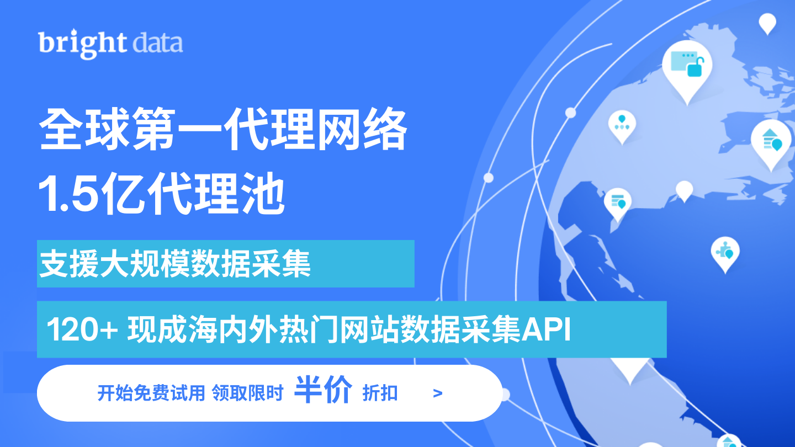</img></a>

[亮数据BrightData](https://get.brightdata.com/naibowang)是代理市场领导者，覆盖全球的7200万IP，提供真人住宅IP，即时批量采集网络公开数据，成功率亲测有保证。需要性价比高代理IP的可**点击上方图片注册**后联系中文客服，开通后免费试用，**现在有首充多少就送多少的活动**。BrightData可配合EasySpider进行数据采集。

<a target="_blank" href="https://www.proxy302.com/?ref=wangnaibo"></img></a>

[Proxy302](https://www.proxy302.com/?ref=wangnaibo)是一个全球代理IP自助超市。按需付费，无需套餐捆绑购买；无阶梯式定价，充值即可使用所有类型的代理IP；免费测试，注册获取$1测试额度。覆盖全球240＋国家和地区，6500万个住宅IP可供选择。Proxy302可配合EasySpider进行数据采集。

<a target="_blank" href="https://www.capsolver.com/zh?utm_source=github&utm_medium=banner_github&utm_campaign=easyspider">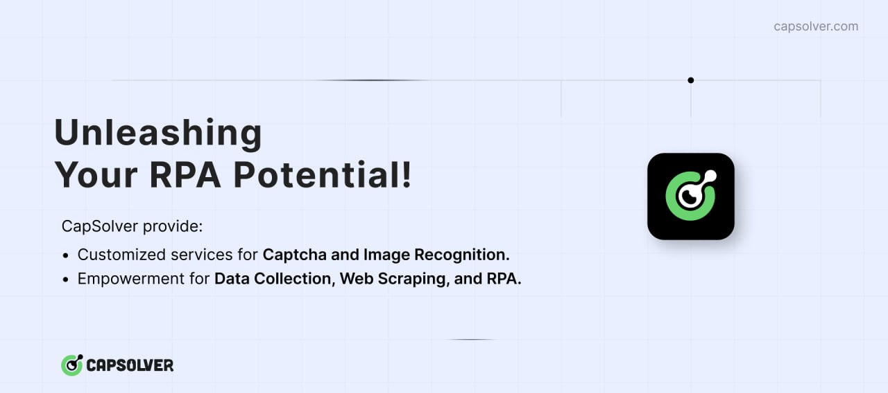</img></a>

<!--  -->

[Capsolver.com](https://www.capsolver.com/?utm_source=github&utm_medium=banner_github&utm_campaign=easyspider) is an AI-powered service that specializes in solving various types of captchas automatically. It supports captchas such as [reCAPTCHA V2](https://docs.capsolver.com/guide/captcha/ReCaptchaV2.html?utm_source=github&utm_medium=banner_github&utm_campaign=easyspider), [reCAPTCHA V3](https://docs.capsolver.com/guide/captcha/ReCaptchaV3.html?utm_source=github&utm_medium=banner_github&utm_campaign=easyspider), [DataDome](https://docs.capsolver.com/guide/captcha/DataDome.html?utm_source=github&utm_medium=banner_github&utm_campaign=easyspider), [AWS Captcha](https://docs.capsolver.com/guide/captcha/awsWaf.html?utm_source=github&utm_medium=banner_github&utm_campaign=easyspider), [Geetest](https://docs.capsolver.com/guide/captcha/Geetest.html?utm_source=github&utm_medium=banner_github&utm_campaign=easyspider), and Cloudflare [Captcha](https://docs.capsolver.com/guide/antibots/cloudflare_turnstile.html?utm_source=github&utm_medium=banner_github&utm_campaign=easyspider) / [Challenge 5s](https://docs.capsolver.com/guide/antibots/cloudflare_challenge.html?utm_source=github&utm_medium=banner_github&utm_campaign=easyspider), [Imperva / Incapsula](https://docs.capsolver.com/guide/antibots/imperva.html?utm_source=github&utm_medium=banner_github&utm_campaign=easyspider), among others.
For developers, Capsolver offers API integration options detailed in their [documentation](https://docs.capsolver.com/?utm_source=github&utm_medium=banner_github&utm_campaign=easyspider), facilitating the integration of captcha solving into applications. They also provide browser extensions for [Chrome](https://chromewebstore.google.com/detail/captcha-solver-auto-captc/pgojnojmmhpofjgdmaebadhbocahppod) and [Firefox](https://addons.mozilla.org/es/firefox/addon/capsolver-captcha-solver/), making it easy to use their service directly within a browser. Different pricing packages are available to accommodate varying needs, ensuring flexibility for users.

<a target="_blank" href="https://www.123proxy.cn/?utm_source=EasySpider">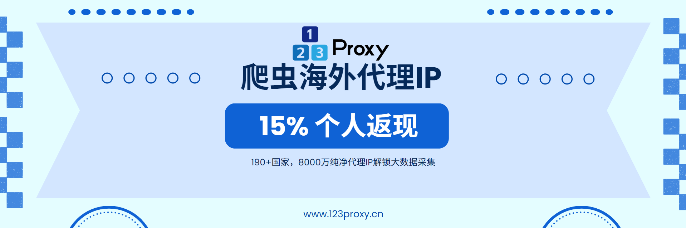</img></a>

[123Proxy](https://www.123proxy.cn/?utm_source=EasySpider)是企业级海外代理IP提供商, 拥有独家的8000万+代理IP池，190+国家覆盖，真实家庭住宅IP，适合各种用途的数据采集类任务。它支持免费测试2-4小时，**点击上方图片注册**联系客服即可获取；它还支持15%返现活动，给公司购买代理可以返现到个人，直接微信/支付宝返现，打工人的小福利。123Proxy可配合EasySpider进行数据采集。

<a target="_blank" href="https://koala-ip.com/"></img></a>

[Koala-IP](https://koala-ip.com/)提供海量低价高质量代理IP服务，致力于为客户提供[最优价格](https://zh-cn.koala-ip.com/var-ip)和最稳定的代理IP解决方案。无论你是需要网络爬虫、数据抓取、隐私保护还是跨地域访问，[Koala-IP（中文）](https://zh-cn.koala-ip.com/) 都能满足你的所有需求。[立即注册Koala-IP](https://koala-ip.com/admin/register)，享受超高性价比的代理IP服务，提升你的业务效益！

## 官方网站/Official Website

访问易采集官网：www.easyspider.cn

Visit the official website of EasySpider: www.easyspider.net

## 软件使用示例/Software Usage Example

### 示例1/Example 1

（右键）选中一个大商品块 -> 软件自动检测到同类型商品块 -> 点击“选中全部”选项 -> 点击“选中子元素”选项 -> 点击“采集数据”选项，即可采集到所有商品的所有信息，并分成不同字段保存。

(Right click) Select a large product block -> The software will automatically detect similar blocks -> Click the 'Select All' option -> Click the 'Select Child Elements' option -> Click the 'Collect Data' option, you can collect the information of all products, and will be saved by sub-field.

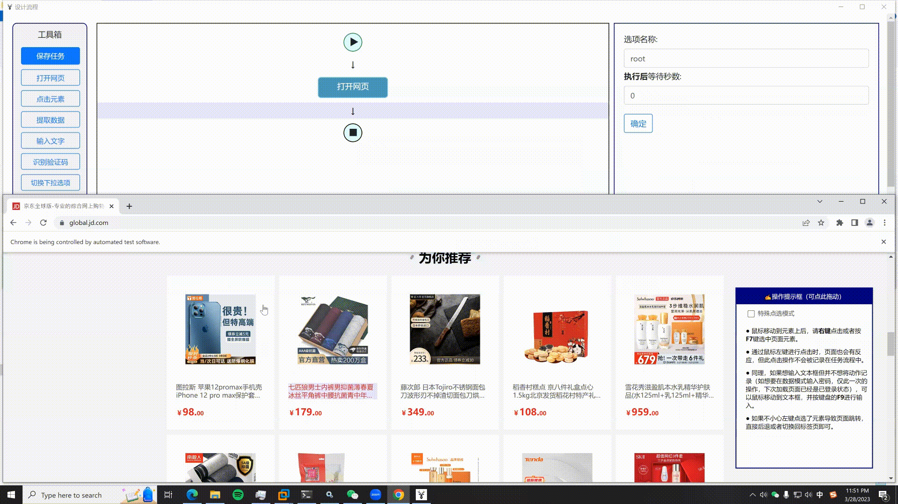

### 示例2/Example 2

（右键）选中一个商品标题，同类型标题会被自动匹配，点击“选中全部”选项 -> 点击“采集数据”选项，即可采集到所有商品的标题信息。

同时，选中全部后如果选择“循环点击每个元素”选项，即可自动打开每个商品的详情页，然后可以再继续设置采集详情页的信息。

(Right Click) Select a product title, the same type of title will be automatically matched, click the 'Select All' option -> Click the 'Collect Data' option, you can collect the title information of all products.

At the same time, if you select the 'Loop-click every element' option after selecting all, you can automatically open the details page of each product, and then can set to collect the information of the details page.

### 更多特性/More Features

更多特性请翻到页面底部查看。

More features please scroll to the bottom of this page to view.

## 支持作者/Support Author

易采集EasySpider是一款完全免费无广告的开源软件，软件开发和维护全靠作者用爱发电，因此您可以选择支持作者让作者有更多的热情和精力维护此软件，或者您使用了此软件进行了盈利，欢迎您通过下面的方式支持作者：

1. Github Sponsor：直接点击右侧**Sponsor**按钮赞助。
2. 支付宝账号：naibowang@foxmail.com，也可以扫描下方二维码。
3. 微信收款：扫描下方二维码。
4. PayPal账号：naibowang，也可以扫描下方二维码。

You can support the author by clicking the **Sponsor** button at right side or pay via paypal: naibowang.

## 文档/Documentation

请点此进入[教程文档](https://github.com/NaiboWang/EasySpider/wiki)，如有英文可暂时翻译一下，或看作者的[硕士毕业论文](Docs/%E9%9D%A2%E5%90%91WEB%E5%BA%94%E7%94%A8%E7%9A%84%E6%99%BA%E8%83%BD%E5%8C%96%E6%9C%8D%E5%8A%A1%E5%B0%81%E8%A3%85%E7%B3%BB%E7%BB%9F%E8%AE%BE%E8%AE%A1%E4%B8%8E%E5%AE%9E%E7%8E%B0.pdf)（主要看第三章和第五章）。

Ebay样例博客：[https://blog.csdn.net/ihero/article/details/130805504](https://blog.csdn.net/ihero/article/details/130805504)。

Documentation can be found from [GitHub Wiki](https://github.com/NaiboWang/EasySpider/wiki).

## 视频教程/Video Tutorials

Bilibili/B站视频教程:

[EasySpider介绍 - 中国地震台网采集案例](https://www.bilibili.com/video/BV1th411A7ey/)

[设置页面向下滚动](https://www.bilibili.com/video/BV1G14y1o7Qa/)

[如何无代码可视化的爬取需要登录才能爬的网站 - 知乎网站案例](https://www.bilibili.com/video/BV1BN411t71C/)

[循环点击列表中每个链接进入详情页采集详情页内容+设计时动态调试+动态JS](https://www.bilibili.com/video/BV12V411D7RZ)

[实战采集汽车网文章内容并下载文章内图片](https://www.bilibili.com/video/BV14u4y1x7S5/)

[定时执行任务+选中子元素多种模式+将提取值作为变量输入](https://www.bilibili.com/video/BV1N94y1a7Lp/)

[【重要】自定义条件判断之使用循环项内的JS命令返回值 - 第二弹](https://www.bilibili.com/video/BV18C4y1V7J7/)

[流程图执行逻辑解析 - 58同城房源描述采集案例](https://www.bilibili.com/video/BV14N4y1o73Y/)

[MacOS系统设计和执行eBay网站爬虫任务教程](https://www.bilibili.com/video/BV1E34y137fT/)

[如何执行自己写的JS代码和系统代码 （自定义操作）](https://www.bilibili.com/video/BV1UH4y1f7BM/)

[如何自定义循环和判断条件 - 第一弹](https://www.bilibili.com/video/BV18w411a77e/)

[如何对元素和网页截图及命令行执行指南](https://www.bilibili.com/video/BV1ch4y1E7cn/)

[OCR识别元素内容功能（常用于文字验证码）](https://www.bilibili.com/video/BV1GP411y7u4/)

[如何爬需要输入验证码的网站](https://www.bilibili.com/video/BV1Rw411C7Hs/)

[如何切换IP池和使用隧道IP - 打开详情页采集案例](https://www.bilibili.com/video/BV1zw411w7BN/)

[如何同时执行多个任务（并行多开）](https://www.bilibili.com/video/BV1Dj411b77M/)

[Python代码运算后的结果作为文本框的输入](https://www.bilibili.com/video/BV1kF411R7VJ/)

[实例 - 反人类网站文章采集和代码调试](https://www.bilibili.com/video/BV1XH4y1Z78i/)

[写入MySQL数据库教程](https://www.bilibili.com/video/BV1os4y1679S/)

[从源代码编译程序并设计运行和调试任务指南（基于Ubuntu24.04）](https://www.bilibili.com/video/BV1VE421P7yj/)

Refer to [Youtube Playlist](https://youtube.com/playlist?list=PL0kEFEkWrT7mt9MUlEBV2DTo1QsaanUTp) to see the video tutorials of EasySpider.

## 样例任务/Sample Tasks

从本项目的[Examples](Examples)文件夹中下载样例任务，更名为大于0的数字，导入到EasySpider中的`tasks`文件夹中，然后在EasySpider中打开即可。

Download sample tasks from the [Examples](Examples) folder of this project, rename them to numbers greater than 0, import them into the `tasks` folder in EasySpider, and then open them in EasySpider.

## 声明/Declaration

本软件仅供学习交流使用，**严禁使用软件进行任何违法违规的操作，如爬取不允许爬取的政府/军事机关网站等**。使用本软件所造成的**一切后果由使用者自负**，与作者本人无关，**作者不会承担任何责任**。

This software is for learning and communication only. **It is strictly forbidden to use the software for any illegal operations, such as crawling government/military websites that are not allowed to be crawled.** All consequences caused by the use of this software are **at the user's own risk, and the author is not responsible for any consequences**. 

对于政府和军事机关等网站的爬虫操作，**作者将不会进行任何答疑**，以免违反国家相关法律法规和政策。

For the crawler operations of government and military websites, **the author will not answer any questions** in order to avoid violating relevant national laws, regulations and policies.

同时，软件受到专利权保护，如要用于商业用途，如使用软件进行盈利接单，出售采集到的数据，或将软件集成到自己的系统中等，请邮件联系作者：naibowang@foxmail.com

Meanwhile, the software is protected by patent rights. If it is used for commercial purposes, such as using the software to make profits, selling the collected data, or integrating the software into your own system, please contact the author by email: naibowang@foxmail.com

<!-- [杭州天勤知识产权代理有限公司](http://www.tqip.com/)进行专利授权等付费操作。 -->

<!-- At the same time, the software is protected by patent rights. If it is used for commercial purposes, such as using the software to make profits, selling the collected data, etc., please contact [Hangzhou Tianqin Intellectual Property Agency Co., Ltd.](http://www.tqip.com/) for patent authorization and other paid operations. -->

## 答疑QQ群

群号：**682921940**，建议通过Github提Issue的方式答疑，如果实在有需要才请加QQ群，因为群人数有上限，**QQ群不提供软件下载功能**。

## 出版物/Publications

- This software has been accepted by The Web Conference (WWW) 2023 (中国计算机学会顶级会议，CCF A): [EasySpider: A No-Code Visual System for Crawling the Web](https://dl.acm.org/doi/abs/10.1145/3543873.3587345), April 2023.

- 中国国家知识产权局发明专利，[一种自定义提取流程的服务封装系统](media/patent.png)， 2022年5月。

- [浙江大学硕士论文](https://d.wanfangdata.com.cn/thesis/Y3691829)，[面向WEB应用的智能化服务封装系统设计与实现](Docs/%E9%9D%A2%E5%90%91WEB%E5%BA%94%E7%94%A8%E7%9A%84%E6%99%BA%E8%83%BD%E5%8C%96%E6%9C%8D%E5%8A%A1%E5%B0%81%E8%A3%85%E7%B3%BB%E7%BB%9F%E8%AE%BE%E8%AE%A1%E4%B8%8E%E5%AE%9E%E7%8E%B0.pdf)，2020年6月。
<!-- - See the [Copyright Declaration Page](https://github.com/NaiboWang/EasySpider/blob/master/media/readme_back.md) here.
 -->

## 编译说明/Compilation Instructions

查看[编译说明](ElectronJS/README.md)。

Refer to [Compilation Instructions](ElectronJS/README.md).

## 支持特性/Supported Features

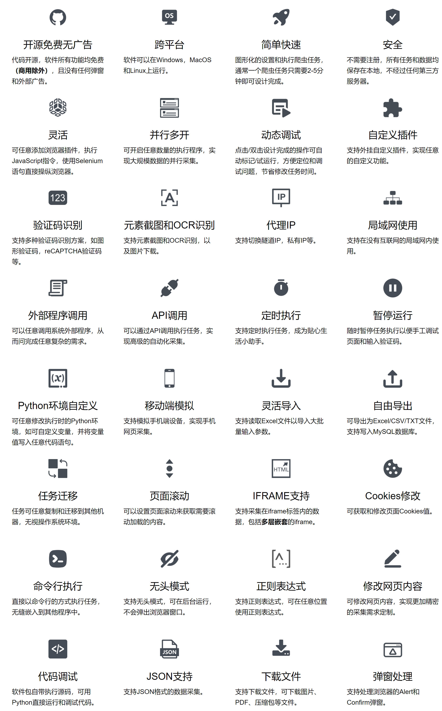
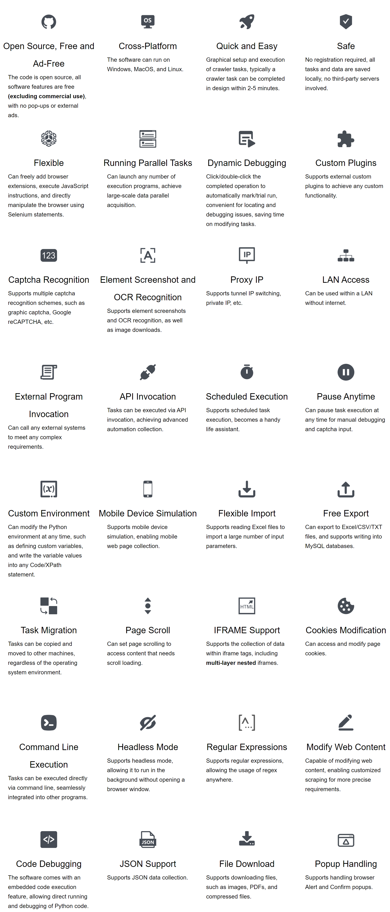

## 中文界面截图

#### 软件界面示例

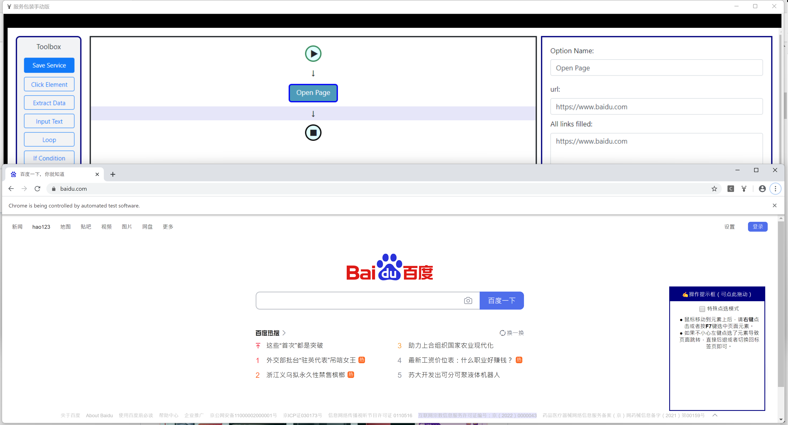
#### 块和子块及表单定义

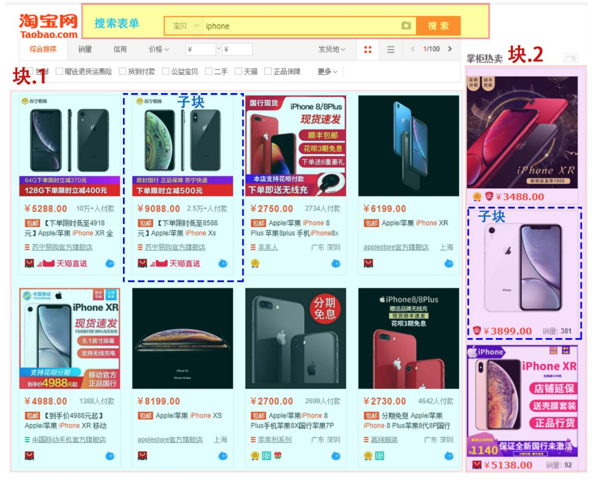
#### 已选中和待选择示例

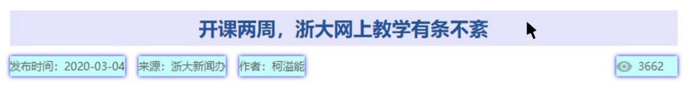
#### 京东商品块选择示例：

#### 京东商品标题自动匹配选择示例

#### 分块选择所有子元素示例

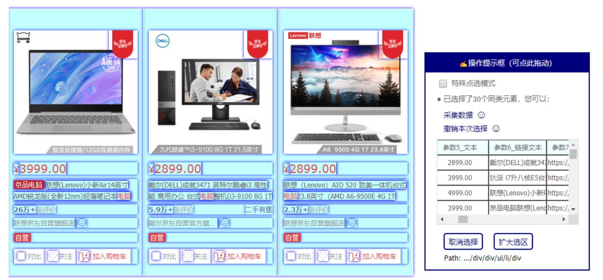

#### 同类型元素自动和手动匹配示例

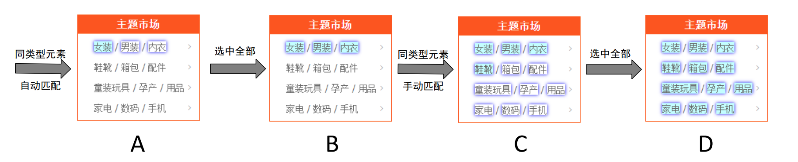
#### 四种选择方式示例

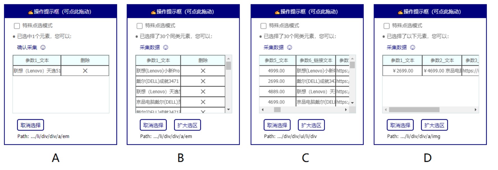
#### 输入文字示例

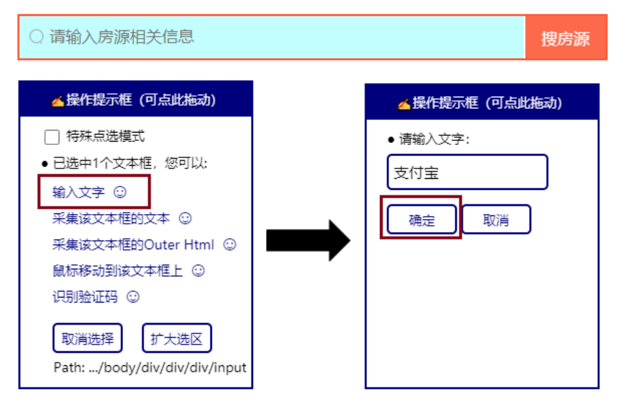
#### 循环点击58同城房屋标题以进入详情页采集示例

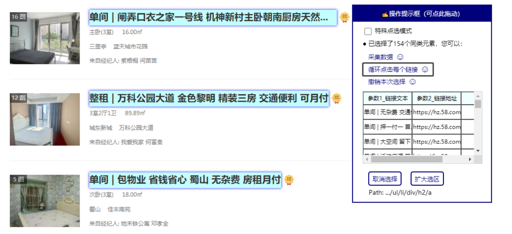
#### 采集元素文本示例

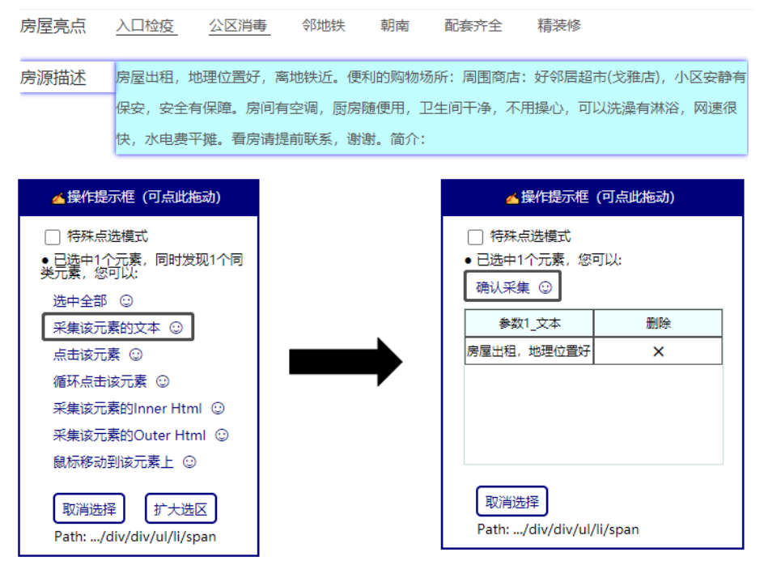
#### 流程图界面介绍

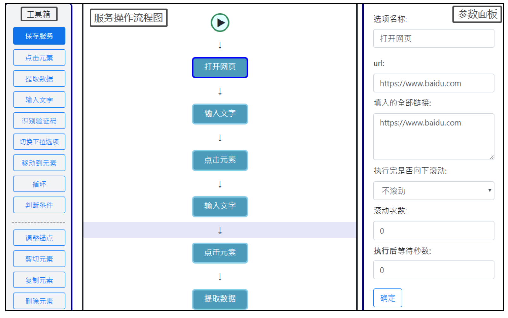
#### 循环选项示例

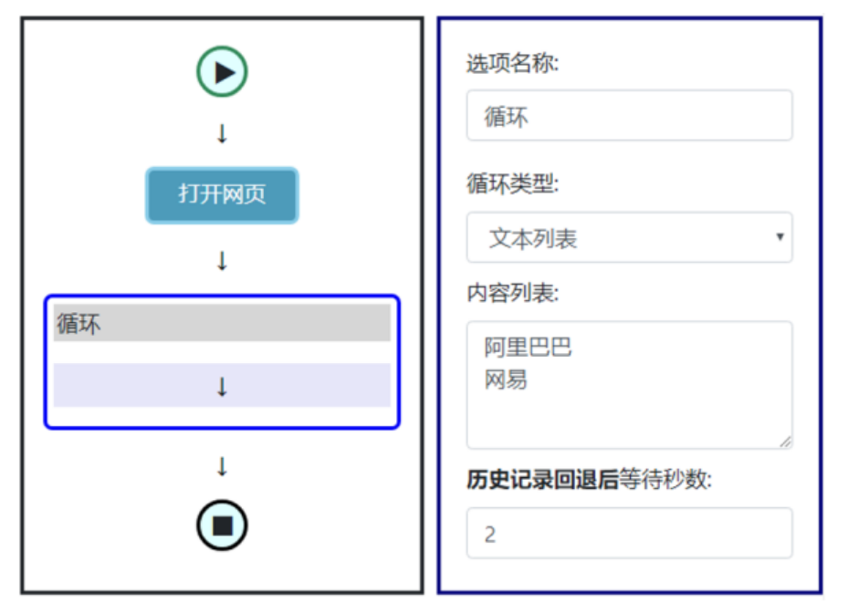

#### 循环点击下一页示例

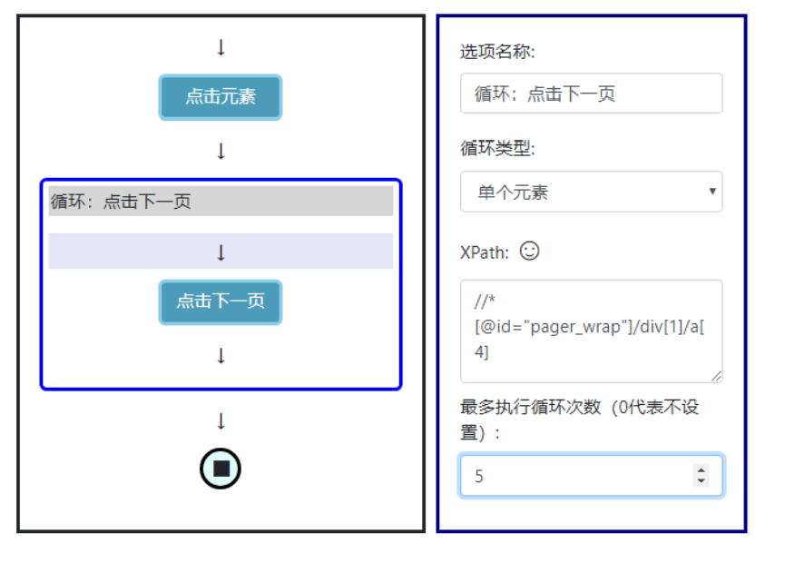

#### 条件分支示例

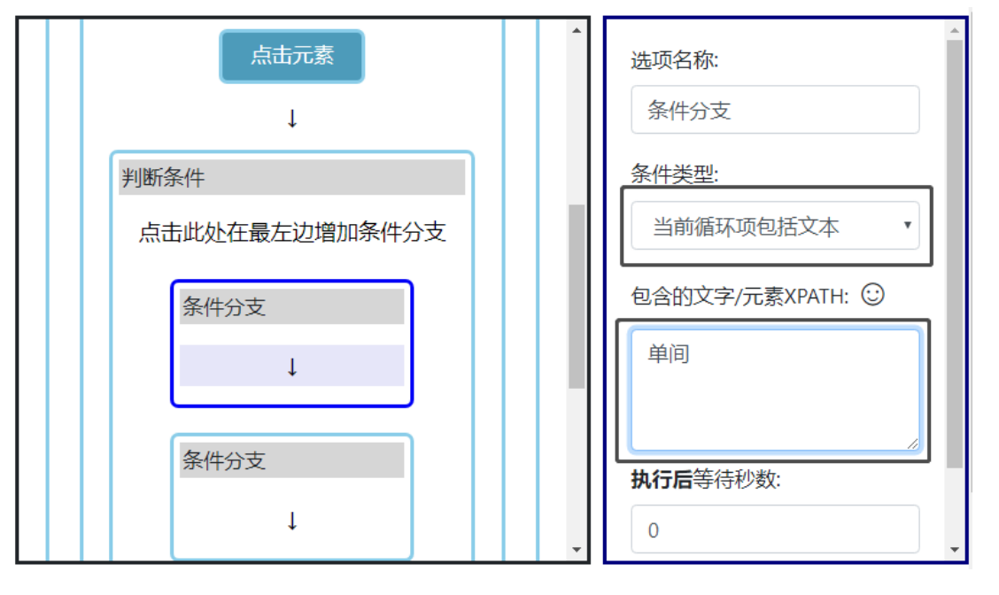
#### 完整采集流程图示例

#### 完整采集流程图转换为常规流程图示例

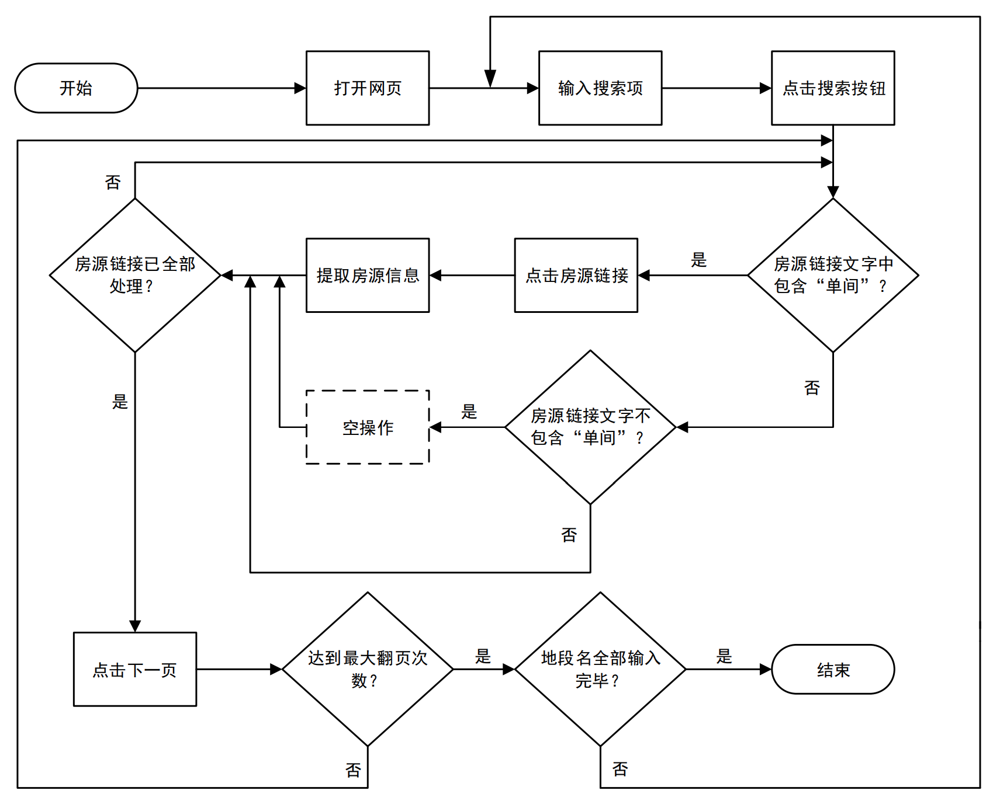
#### 服务信息示例

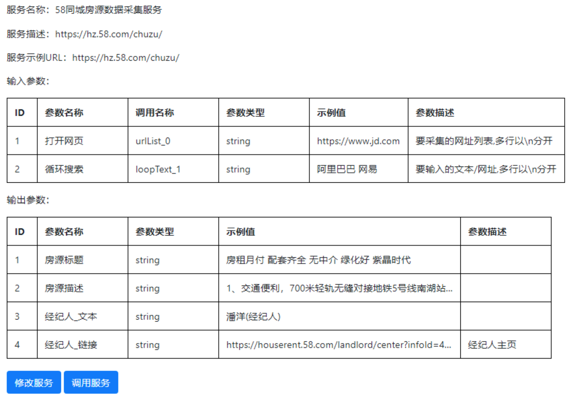

#### 服务调用示例

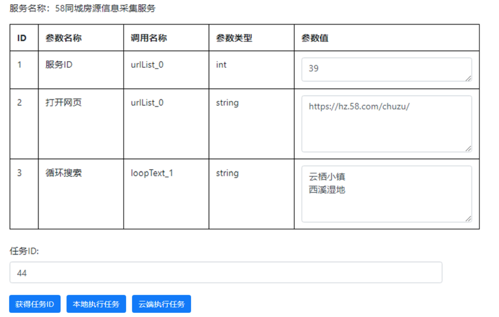

#### 58 同城房源信息采集服务部分采集结果展示
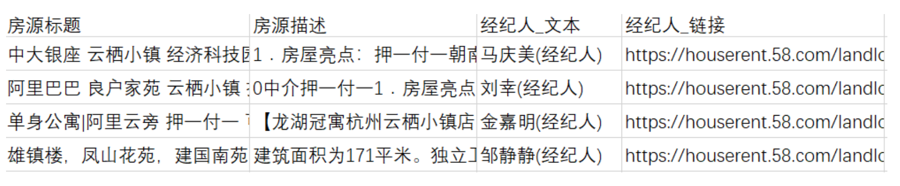

<!-- ## Ethics Discussion
Various fields can benefit from web crawlers due to their open access nature.
Inevitably, there will be some risk of malicious use or data infringement issue, e.g., automatic order swiping and ticket grabbing, but this is contrary to our expectations. As a tool developer, we only hope that it can be used for legitimate purposes. We advocate the reasonable and legal utilization of our system, respecting and protecting the data security and privacy. -->
