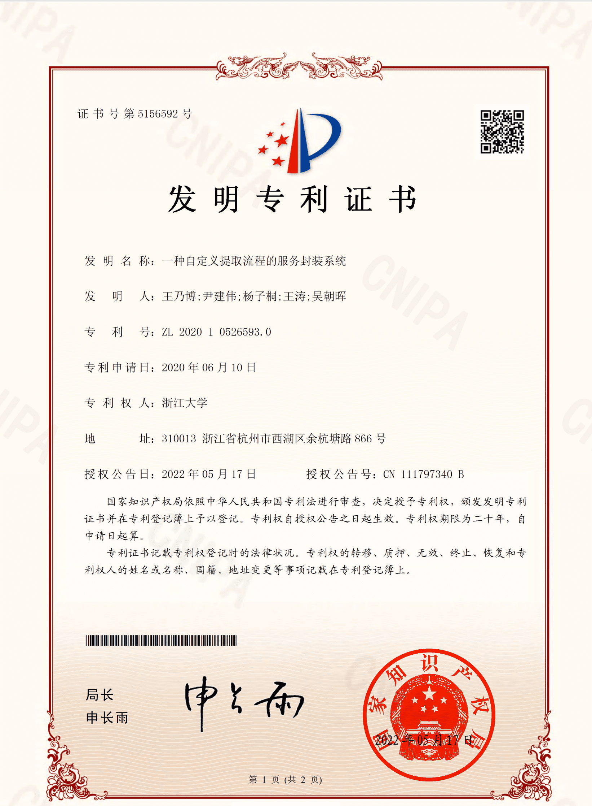

## Copyright Declaration 版权声明

This tool/software has been granted a patent for invention by the State Intellectual Property Office of the People's Republic of China, and thus the intellectual property is protected by Chinese law. In the spirit of openness in research and open source community, the code of this tool is open and available for free use by researchers and other related persons with the authorization of Zhejiang University and related persons. However, if you need to use it **commercially**, please contact the author or the person in charge of Zhejiang University by email.

该工具/软件已获得中华人民共和国国家知识产权局授权发明专利证书，因此知识产权受中国法律保护。本着科研和开源社区的开放精神，经浙江大学和相关人员授权，该工具代码公开且可供科研人员和其他相关人员免费使用。但**如需商业使用**，请通过邮件联系作者或浙江大学相关负责人。

<!--  -->

Main Inventor Information:

专利主要发明人信息：

Wang: Ph.D. student at National University of Singapore, personal homepage: <https://naibo.wang>

王: 新加坡国立大学在读博士生，个人主页：<https://naibo.wang>

Yin: Professor of College of Computer Science and Technology of Zhejiang University, deputy dean, personal page: < https://person.zju.edu.cn/0001038 >

尹: 浙江大学计算机学院教授，副院长，个人主页：<https://person.zju.edu.cn/0001038>

 

## 可能的错误

- System.Net.Sockets.SocketException 以一种访问权限不允许的方式做了一个访问套接字的尝试
  重启电脑一般可以解决
<!-- START doctoc generated TOC please keep comment here to allow auto update -->
<!-- DON'T EDIT THIS SECTION, INSTEAD RE-RUN doctoc TO UPDATE -->
# 目录
注：文档待完善
- [目录](#目录)
  - [界面截图](#界面截图)
      - [软件界面示例](#软件界面示例)
      - [块和子块及表单定义](#块和子块及表单定义)
      - [已选中和待选择示例](#已选中和待选择示例)
      - [京东商品块选择示例：](#京东商品块选择示例)
      - [京东商品标题自动匹配选择示例](#京东商品标题自动匹配选择示例)
      - [分块选择所有子元素示例](#分块选择所有子元素示例)
      - [同类型元素自动和手动匹配示例](#同类型元素自动和手动匹配示例)
      - [四种选择方式示例](#四种选择方式示例)
      - [输入文字示例](#输入文字示例)
      - [循环点击58同城房屋标题以进入详情页采集示例](#循环点击58同城房屋标题以进入详情页采集示例)
      - [采集元素文本示例](#采集元素文本示例)
      - [流程图界面介绍](#流程图界面介绍)
      - [循环选项示例](#循环选项示例)
      - [循环点击下一页示例](#循环点击下一页示例)
      - [条件分支示例](#条件分支示例)
      - [完整采集流程图示例](#完整采集流程图示例)
      - [完整采集流程图转换为常规流程图示例](#完整采集流程图转换为常规流程图示例)
      - [服务信息示例](#服务信息示例)
      - [服务调用示例](#服务调用示例)
      - [58 同城房源信息采集服务部分采集结果展示](#58-同城房源信息采集服务部分采集结果展示)
  - [服务包装手动版程序结构](#服务包装手动版程序结构)
    - [Chrome插件部分](#chrome插件部分)
    - [后台流程图部分](#后台流程图部分)
    - [服务展示部分](#服务展示部分)
    - [C#部分](#c部分)
    - [后台服务页面](#后台服务页面)
    - [服务执行](#服务执行)

<!-- END doctoc generated TOC please keep comment here to allow auto update -->

## 界面截图

#### 软件界面示例

#### 块和子块及表单定义

#### 已选中和待选择示例

#### 京东商品块选择示例：

#### 京东商品标题自动匹配选择示例

#### 分块选择所有子元素示例

#### 同类型元素自动和手动匹配示例

#### 四种选择方式示例

#### 输入文字示例

#### 循环点击58同城房屋标题以进入详情页采集示例

#### 采集元素文本示例

#### 流程图界面介绍

#### 循环选项示例

#### 循环点击下一页示例

#### 条件分支示例

#### 完整采集流程图示例

#### 完整采集流程图转换为常规流程图示例

#### 服务信息示例

#### 服务调用示例

#### 58 同城房源信息采集服务部分采集结果展示

## 服务包装手动版程序结构
### Chrome插件部分
* Extension/app内的文件

### 后台流程图部分
* ServiceGrid/frontEnd/FlowChart.html
* ServiceGrid/frontEnd/FlowChart_Deprecated.js
* ServiceGrid/frontEnd/FlowChart.css
* ServiceGrid/frontEnd/logic.css

### 服务展示部分
* 服务列表：ServiceGrid/frontEnd/serviceList.html
* 服务信息：ServiceGrid/frontEnd/serviceInfo.html
* 新服务：ServiceGrid/frontEnd/newTask.html
* 调用服务：ServiceGrid/frontEnd/invokeService.html

### C#部分
* C#/内的文件

### 后台服务页面
* Django后台：ServiceGrid/backEnd/*

### 服务执行
* ExcuteStage/ServiceWrapper_ExcuteStage.py
